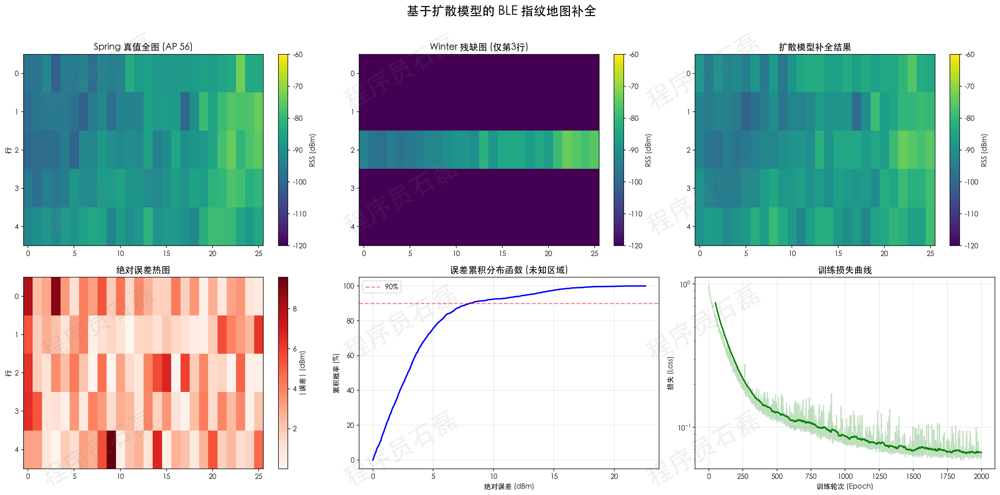

# 用扩散模型补全 BLE 指纹地图：一次完整的实践记录

## 问题是什么

室内定位有一种经典方法叫**指纹定位**：事先在室内各个位置采集蓝牙（BLE）信号强度，构建一张"指纹地图"，定位时拿实时信号去匹配。

方法不复杂，但有个现实痛点——**采集成本高**。

以本文使用的 Log-a-TEC 公开数据集为例：

- **Spring 数据集**：覆盖 5 行 × 26 列 = 130 个测量点，25 个 BLE AP，总计 72 万条 RSS 采样。这是完整的。
- **Winter 数据集**：只采了中间第 3 行的 26 个点，其余 4 行全部缺失。

问题就很直接了：**能不能用有限的数据，把缺失的部分补出来？**

## 为什么选扩散模型

补全缺失数据，本质是一个**条件生成**问题。这恰好是扩散模型擅长的事情。

图像领域有个任务叫 Inpainting（图像修复）：把图片中被遮挡的部分"脑补"出来。我们这里做的事情一模一样，只不过"图片"换成了 RSS 信号地图，"遮挡"换成了未采集的区域。

具体来说：

1. **训练阶段**：拿 Spring 全量数据，随机挖掉一部分，让模型学会"看到残缺，补出完整"
2. **推理阶段**：把 Winter 的残缺数据喂进去，生成完整的 5 × 26 地图

## 模型设计

### 数据表示

把指纹地图组织成一个三维张量：**[25个AP, 5行, 26列]**。每个位置、每个 AP 取多次 RSS 采样的均值，归一化到 [-1, 1]。

### 网络输入

采用通道拼接（channel concatenation）的方式注入条件信息：

```
输入 = [加噪地图(25ch) | 掩膜(1ch) | 残缺条件图(25ch)] = 51 通道
输出 = 预测噪声(25ch)
```

掩膜标记哪些位置是已知的（=1）、哪些需要补全（=0）。

### 网络结构

标准的 2D U-Net，三层下采样 + 注意力机制。因为原始地图尺寸 5×26 太小，三次下采样后会崩溃，所以先 padding 到 8×32，推理后裁回来。

### 训练策略

几个实际有用的细节：

- **数据增强**：每个位置有约 220 次 RSS 采样。每轮随机抽取 50% 求均值，制造带自然抖动的训练样本，从 1 张扩充到 128 张。
- **多样化掩膜**：不只是随机挖一行，还有多行保留、随机散点、矩形块等模式，让模型见过各种缺失情况。
- **加权损失**：未知区域的损失权重更高（1.0 vs 0.3），让模型重点学好补全部分。

### 推理加速

训练用标准 DDPM（1000 步），推理切换到 **DDIM**（50 步），速度快 20 倍，质量基本不损失。

同时启用 **RePaint 技巧**：每一步去噪后，已知区域的值强制替换为真实数据对应时间步的加噪版本。这保证了已知区域的信息不会在去噪过程中被"忘掉"。

最终采样 10 次取均值，顺便得到不确定性估计。

## 实验结果

在 MacBook（Apple Silicon MPS）上训练 2000 轮，约 10 分钟。

### 核心指标

| 指标 | 数值 | 说明 |
|:---|:---|:---|
| 未知区域 RMSE | **5.33 dBm** | 补全精度 |
| 未知区域 MAE | **3.86 dBm** | 平均绝对误差 |
| 50% 误差 | **< 2.9 dBm** | 一半点误差很小 |
| 90% 误差 | **< 8.0 dBm** | 绝大多数点可用 |
| 已知区域 vs Winter | **0.00 dBm** | RePaint 完美保真 |

### 可视化



从上图可以看到：

- **左上**（Spring 真值）vs **右上**（补全结果）：整体信号分布模式吻合
- **左下**（误差热图）：大部分区域误差在 3 dBm 以内，靠近边缘行的误差稍大
- **中下**（CDF 曲线）：75% 的补全点误差在 5 dBm 以下

### 一个有意思的发现

已知区域（第 3 行）对比 Spring 同位置数据的 RMSE 为 14.51 dBm。这不是模型误差——这是 **Spring 和 Winter 之间的季节性差异**。两次采集间隔几个月，室内环境变化导致同一位置的 BLE 信号本身就不同了。

这也从侧面说明，指纹地图确实需要定期更新，而扩散模型可以用少量新数据快速生成完整地图，降低更新成本。

## 代码结构

整个实现在一个 610 行的 Python 文件中，依赖 PyTorch 和 HuggingFace Diffusers：

```
diffusion_map_completion.py
├── Config                    # 全局配置
├── BLEFingerprintDataset     # 数据加载、归一化、增强、填充
├── create_unet()             # 模型定义
├── generate_diverse_masks()  # 多样化掩膜生成
├── train()                   # 训练循环
├── infer()                   # DDIM + RePaint 推理
├── evaluate()                # RMSE / MAE / CDF 评估
└── visualize()               # 结果可视化 + 水印
```

支持两种运行方式：

```bash
# 完整流程：训练 + 推理 + 评估 + 出图
python diffusion_map_completion.py

# 跳过训练，加载已有模型直接出图
python diffusion_map_completion.py --skip-train
```

## 局限和可以继续做的事

说几点不足：

1. **训练数据有限**：只有一张 5×26 的地图，靠子采样增强到 128 张。数据量对于 1600 万参数的模型来说仍然偏少。
2. **跨季节评估存在偏差**：模型在 Spring 数据上训练，用 Winter 条件推理，但评估又用 Spring 做真值。严格来说，Winter 的真值我们并没有（那 4 行就是因为没采才需要补全的）。
3. **没做下游定位验证**：补全的地图质量好不好，最终要看拿它去做定位时精度如何。这步还没做。

可以继续探索的方向：

- 把补全的地图接上 KNN / 神经网络定位器，做端到端评估
- 引入建筑楼层平面图作为额外条件，提升空间一致性
- 在更大规模的数据集上验证泛化能力
- 用 DDIM 的确定性采样做消融实验，对比 RePaint 的实际增益

## 小结

这个项目做了一件简单直接的事情：**把扩散模型当 Inpainting 工具，给残缺的 BLE 指纹地图补上缺失的部分**。

核心思路不复杂，工程实现也不长，但结果还不错——50% 的补全点误差在 3 dBm 以内。对于室内定位这个场景来说，这意味着可以少跑大半区域的采集，用模型生成代替人工采集，实实在在降低了指纹库的构建成本。

扩散模型在信号处理领域的应用才刚刚开始，指纹地图补全只是其中一个切入点。如果你也在做相关方向，希望这篇记录能提供一些参考。

---

*数据集来源：[Log-a-TEC BLE Fingerprint Dataset](http://log-a-tec.eu/datasets-ble.html)*

*完整代码见同目录 `diffusion_map_completion.py`*
